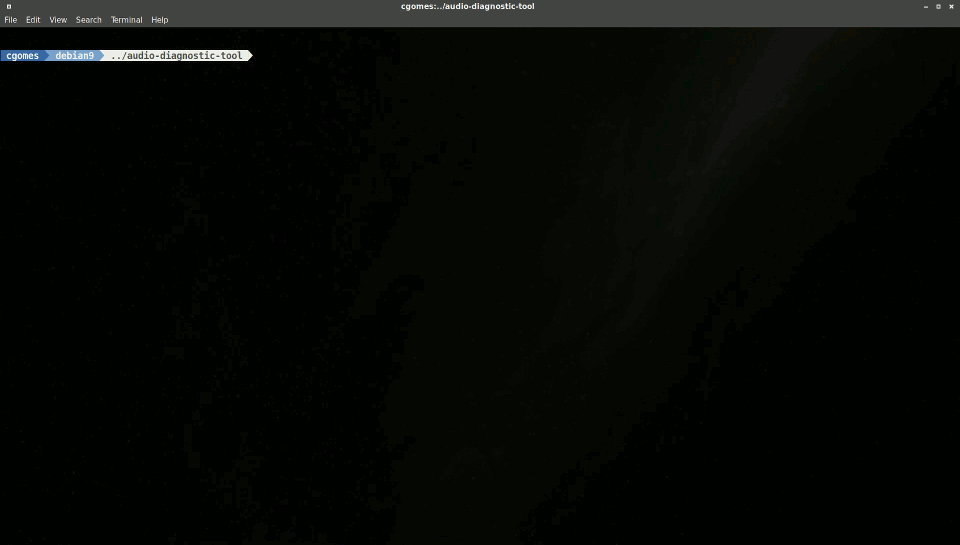

# audio-diagnostic-tool
This is a CLI diagnostic tool for audio files written in GNU Bash that extends my previous [bash-flac-diag tool](https://github.com/cgomesu/bash-flac-diag) to mp3 and other audio formats. In brief, it tests a single or multiple audio files ([see Supported Formats](#supported-formats)) and generates logs with good files (no errors found) and bad ones (at least one error found). Tests are performed by codec-specific tools ([see Requisites](#requisites)). There are two post-processing modes for bad files: fix or delete ([see Usage](#usage)).

This tool is meant to be used to identify corrupted audio files that should be fixed or deleted from an audio library, for example, or added as a post-processing command for audio-downloaders to create a new audio integrity check layer. Here's a demo of it:

<p align="center">
	<a href="https://youtu.be/RwcA_2fjmv4"></a>
</p>

# Supported Formats
* flac
* mp1, mp2, mp3

This list is not meant to be static. The goal is to keep adding new formats as I learn about other codec-specific tools that are able to test for errors and fix common issues. 

# Requisites
* [**flac cli**](https://xiph.org/flac/download.html)
* [**mp3val**](http://mp3val.sourceforge.net/download.shtml)
* **Standard Linux packages** 

All requisities are automatically checked.

# Installation
**DISCLAIMER**: I've only tested on Debian and Ubuntu but it probably works just fine with any other standard Linux distro. If you run into an issue, let me know about it and I'll try to fix it.

The tool will automatically check for missing packages and commands, and if there's something missing, it will let you know about it and if possible, prompt to install missing packages. Make sure that if the packages are already installed, they're also in your user's `$PATH`.

## Debian/Ubuntu
* Via git
```
sudo apt update
sudo apt install git -yy
cd /opt
sudo git clone https://github.com/cgomesu/audio-diagnostic-tool.git
sudo chmod +x audio-diagnostic-tool/ -R
```

* Via github cli
```
sudo apt-key adv --keyserver keyserver.ubuntu.com --recv-key C99B11DEB97541F0
sudo apt-add-repository https://cli.github.com/packages
sudo apt update
sudo apt install gh
cd /opt
sudo gh repo clone cgomesu/audio-diagnostic-tool
sudo chmod +x audio-diagnostic-tool/ -R
```

# Usage
```

./diagnostic-tool.sh -t /path/to/dir/or/file [OPTIONS]

  Required:
    -t  str  Path to a dir or file to be tested. If dir, it works recursively as well.

  Optional:
    -e  str  File extension to test (e.g., mp3). Default: common audio file extensions.
    -h       Show this help message.
    -l  str  Path to an existing dir where the log/ will be stored. Default: ./
    -p  str  Post-processing mode for flagged files: fix, delete, none. Default: none.

```

This tool will *always* generate log files and after running more than once, it will *always* check previously created log files to make sure the current audio file has not been tested before; otherwise, the file is skipped.  So, if you need to re-test one or multiple files, make sure to delete the previous log files or use a different path to the `log/` subdir (`-l`). 

# Examples
To scan and test all supported audio files in a music directory recursively, simply run `diagnostic-tool.sh` adding the `-t /full/path/to/music/folder/` as argument, as follows:

```
./diagnostic-tool.sh -t /full/path/to/music/folder/
```
or
```
bash diagnostic-tool.sh -t /full/path/to/music/folder/
```

This will create a `./log` subdir with two log files, namely `bad_files.log` and `good_files.log`.  The former has a list with the path of each file that has produced at least a single error, while the latter has a list with the path of each file that has not produced any errors.  A detailed description of all errors produced by each file are stored on `./log/errors/` for debugging. (Optionally, you may specify a custom directory for the `log/` subdir by using the `-l` argument followed by the full path to an exisiting directory where the `log/` subdir will be created.)

## Example 0: Test a single file
```
./diagnostic-tool.sh -t /full/path/to/file
```

## Example 1: Test only `mp3` files recursively
```
./diagnostic-tool.sh -t /full/path/to/music/folder/ -e mp3
```

## Example 2: Test files recursively and fix bad files
```
./diagnostic-tool.sh -t /full/path/to/music/folder/ -p fix
```

## Example 3: Test recursively, delete bad files, and use `/home/cgomes/` to store the `log/` subdir
```
./diagnostic-tool.sh -t /full/path/to/music/folder/ -p delete -l /home/cgomes
```
